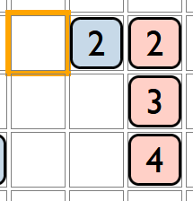
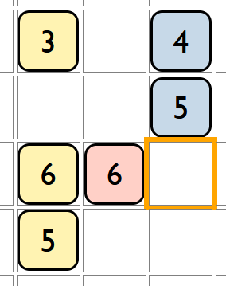

## Overview
Rummikruss is a strategic board game where players strategically place cards from different suites to create connected patterns. The goal is to maximize your score by forming sets while strategically blocking your opponent's moves.

## Setup
- Decide hyper-parameter
   + b := board size (5-20 squares)
   + n := number of colors (1-8)
   + c := largest number in the deck (5-16)
   + r := number of repetitions of cards with the same color.
- A deck with 2(n\*c\*r) will be created.
- Few randomly selected card will randomly placed on the board
## Game Rules

### Basic Placement Rules
1. Players alternate turns placing cards on empty board cells
2. Card placement must create a valid set:
   - Ascending sequence (e.g., 1-2-3... with the same color)
   - Descending sequence (e.g., 3-2-1... with the same color)
   - Repeated number in different colors

3. Placement Restrictions:
   - Cards can only be placed in empty cells
   - Must connect to form a valid set
   - Last played blocks the cards with the same color and number for the next player.

### Scoring Mechanics
- The score is updated as the length of the largest sequence made by the newly added card (refer example 1 below).
- Bonus: if the placed card connects two disconnected blocks the new score would be the total number of connected cards containing the placed card (refer example 2 below). 

### Scoring Examples
| Scenario | Placement | Points Earned |
|----------|-----------|---------------|
|  | Yellow 2 | 3 points (3 connected '2's) |
|  | Blue 6 | 6 points (connecting blue, red, yellow cards) |

### Winning the Game
- Game ends when:
  - All cards are played
  - No valid moves remain
- Highest total score wins

## Strategic Tips
- Look for multi-directional connections
- Create opportunities for large set formations
- Block opponent's potential high-scoring moves
